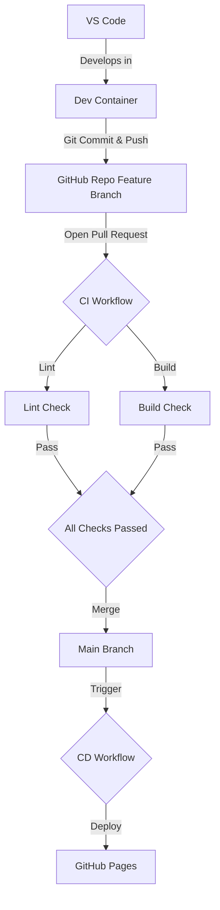

## Phase 1 The DevOps Architechture

### Diagram

### Components

| Component | Choice |
|----|-----|
| Local Env | Dev Container |
| Bundler | Vite |
| Hosting | GitHub Pages (For now) |
| CI System | GitHub Actions (For now) |